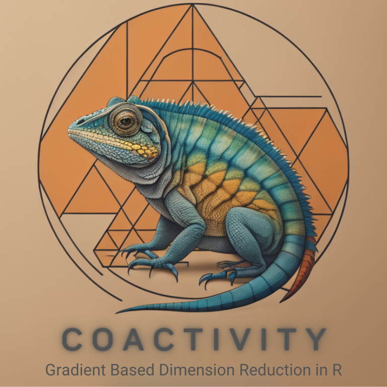

coactivity: Active and Co-active Subspaces in R
================

[](https://www.gnu.org/licenses/gpl-3.0)
[](https://github.com/knrumsey/concordance)

<!-- README.md is generated from README.Rmd. Please edit that file -->

<div class="figure">


<p class="caption">

<span style="font-size:50%;">This logo was designed by Imagine AI Art
Studio.</span>
</p>

</div>

### Description

`coactivity` is an R package for performing concordance analyses and for
the [discovery of active subspaces in
high-dimensions](https://arxiv.org/pdf/2307.11241.pdf) (described in K.
Rumsey, Francom, and Vander Wiel (2024)). The “workhorse” of the package
is the `C_bass()` function, which estimates *Constantine’s* $C$ matrix
(see Constantine (2015)) for a given computer model and behaves
similarly to the `activegp::C_gp()` function (described in Wycoff,
Binois, and Wild (2021)). The `C_bass()` function, which relies on a
Bayesian MARS emulator (as described in Francom and Sansó (2020) and
implemented in the [BASS
package](https://CRAN.R-project.org/package=BASS)) is likely to be more
efficient and accurate when the dimension of the input space is large
and admits a large class of *measures* for the inputs.

The package can also be used to estimate *co-active subspaces*, as
described in K. N. Rumsey et al. (2024).

To install this package, use

``` r
# install.packages("devtools")
devtools::install_github("knrumsey/coactivity")
```

This R package is based on the method described
[here](https://www.tandfonline.com/doi/pdf/10.1080/10618600.2023.2277297)
and
[here](https://www.tandfonline.com/doi/pdf/10.1080/00401706.2024.2407314).
A vignette for this package is also available and can be viewed by
typing `browseVignettes("concordance")` in R (after installation).

### Example Usage

Traditional active subspaces can be computed using the `C_bass()`
function.

``` r
# Load libraries
library(BASS)
library(coactivity)

# Generate data
f <- function(x, t) { 
  10 * sin(pi * t * x[1]) + 20 * (x[2] - 0.5)^2 + 10 * x[3] + 5 * x[4]
}
X <- lhs::randomLHS(500, 5)
y <- apply(X, 1, f, t = 0.5)

# Fit BASS model (scalar response)
mod <- BASS::bass(X, y)

# Estimate C matrix
C <- coactivity::C_bass(X, y)

# Get active subspace
W <- eigen(C)$vectors
Lambda <- eigen(C)$values
```

For functional response, we can do this three different ways.

1.  A list of scalar-response BASS models
2.  A functional response BASS model with the `bass()` function.
3.  A functional response BASS model using orthogonal basis
    decomposition, e.g., via `bassPCA()`.

There is generally no reason to use method 1, as methods 2 and 3 are
often preferable. Note that method 3 is likely to be much more efficient
for functional response, though method 2 can lead to better model fits
in some circumstances.

Moving beyond typical active subspaces, consider also *co-active
subspaces* with `Cfg_bass()` or the Zahm (and co-Zahm) matrices with
`K_bass()` and `Kfg_bass()`. Finally, to treat the functional variable
$t$ as just another input to the model, use `C_aug_bass()` and
`Cfg_aug_bass()`.

## Copyright Notice

© *2023. Triad National Security, LLC. All rights reserved.*

*This program was produced under U.S. Government contract
89233218CNA000001 for Los Alamos National Laboratory (LANL), which is
operated by Triad National Security, LLC for the U.S. Department of
Energy/National Nuclear Security Administration. All rights in the
program are reserved by Triad National Security, LLC, and the U.S.
Department of Energy/National Nuclear Security Administration. The
Government is granted for itself and others acting on its behalf a
nonexclusive, paid-up, irrevocable worldwide license in this material to
reproduce, prepare derivative works, distribute copies to the public,
perform publicly and display publicly, and to permit others to do so.*

## References

<div id="refs" class="references csl-bib-body hanging-indent"
entry-spacing="0">

<div id="ref-constantine2015active" class="csl-entry">

Constantine, Paul G. 2015. *Active Subspaces: Emerging Ideas for
Dimension Reduction in Parameter Studies*. SIAM.

</div>

<div id="ref-francom2020bass" class="csl-entry">

Francom, Devin, and Bruno Sansó. 2020. “Bass: An r Package for Fitting
and Performing Sensitivity Analysis of Bayesian Adaptive Spline
Surfaces.” *Journal of Statistical Software* 94 (LA-UR-20-23587).

</div>

<div id="ref-rumsey2024co" class="csl-entry">

Rumsey, Kellin N, Zachary K Hardy, Cory Ahrens, and Scott Vander Wiel.
2024. “Co-Active Subspace Methods for the Joint Analysis of Adjacent
Computer Models.” *Technometrics*, no. just-accepted: 1–24.

</div>

<div id="ref-rumsey2024discovering" class="csl-entry">

Rumsey, Kellin, Devin Francom, and Scott Vander Wiel. 2024. “Discovering
Active Subspaces for High-Dimensional Computer Models.” *Journal of
Computational and Graphical Statistics* 33 (3): 896–908.

</div>

<div id="ref-wycoff2021sequential" class="csl-entry">

Wycoff, Nathan, Mickael Binois, and Stefan M Wild. 2021. “Sequential
Learning of Active Subspaces.” *Journal of Computational and Graphical
Statistics* 30 (4): 1224–37.

</div>

</div>
